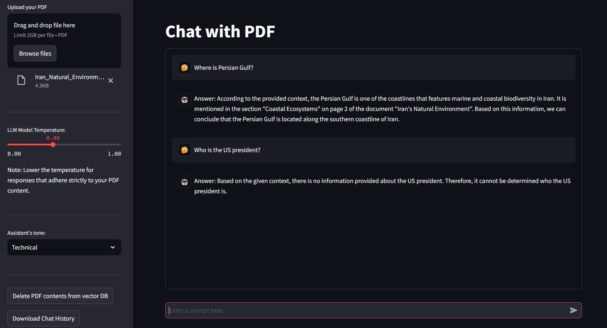

# 🤖 RAG Web Application 

This project is a conversational chatbot application built with **Streamlit** and powered by the **Zephyr-7B-α** language model. The chatbot can engage users in informative and dynamic conversations, using both text and structured data from uploaded PDF documents as context.

Try my app: https://whisperingpdf.streamlit.app/



### Overview

This application enables users to chat with a PDF-based assistant that leverages the Zephyr-7B-α model. Whether you’re looking for precise answers based on document contents or casual conversation, this application offers an interactive, user-friendly experience directly in the browser.

---

### Features

- **Role-Specific Tones**: Adjust the assistant’s tone with options like Friendly, Formal, Technical, and Concise for tailored responses.
- **Customizable Temperature**: Modify the response creativity through temperature control, offering focused responses based on your PDF content. Note: lower the temperature for responses that adhere strictly to your PDF content.
- **Session History Download**: Download your chat history in OpenAI’s JSON format, making it easy to keep records or analyze conversations.

---

### Model Information

The core of this chatbot application is **Zephyr-7B-α**, a language model in the Zephyr series, specifically trained to serve as a helpful, conversational assistant. [**Zephyr-7B-α**](https://huggingface.co/HuggingFaceH4/zephyr-7b-alpha) is based on [**mistralai/Mistral-7B-v0.1**](https://huggingface.co/mistralai/Mistral-7B-v0.1) and fine-tuned on a combination of publicly available and synthetic datasets. 

---

### Setup and Installation

To set up and run this application, follow these steps:

1. **Clone the Repository**
   ```bash
   git clone https://github.com/parsafarshadfar/rag_webapp.git
   ```

2. **Install Dependencies**  
   Ensure you have Python 3.8+ installed. Install the required packages:
   ```bash
   pip install -r requirements.txt
   ```

3. **Set up Hugging Face API Token**

   Replace HF_TOKEN value in the code with your Hugging Face API token. You can obtain a free API token [**here**](https://huggingface.co/settings/tokens/).
   
4. **Local Usage Note**
   
   step 1, Comment the first three lines if you are using tha app locally.
  
   step 2, Start the Streamlit app using the following command in terminal:
   
   ```bash
   streamlit run app.py

   or 

   python -m streamlit run app.py
   ```

This will launch the application on `http://localhost:8501`, where you can upload PDF files and query content. The app can also be deployed on [Streamlit Cloud](https://share.streamlit.io/) or other cloud platforms like Azure, AWS, and more.

---
